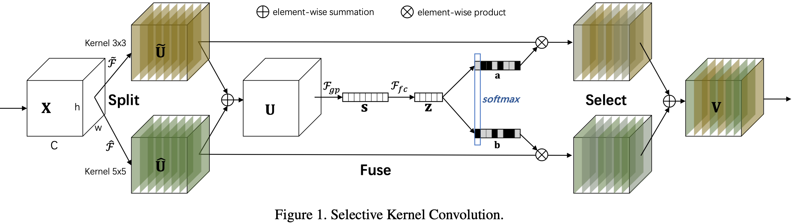
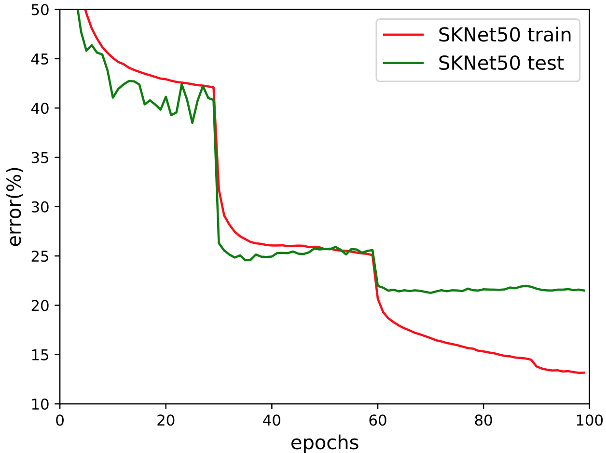

# SKNet
Implemenation of [Selective Kernel Networks](https://arxiv.org/abs/1903.06586) by pytorch.

The architecture of **SK** is as follows

I trained **SKNet50** on ImageNet-2012 from scratch and got an accuracy of **21.26**, 
which did not reach the performance of **20.79** in the paper.
_If somebody know what caused the problem, please leave me a message._ 

I also trained **ResNet50** with the same hyperparameters and settings, and got a performance of 23.30.

Both of the two pretrained models are provided below.

## Requirement
- `pytorch 1.4.0`
- `torchvision`
- `tensorboard 1.14+`
- `numpy`
- `pyyaml`
- `tqdm`
- `pillow`

## Dataset
- `ImageNet-2012`
- `CIFAR-10`
- `CIFAR-100`

## Pretrained Model on ImageNet-2012

| Architecture | Top-1 error | Pretrained model|
| :----: | :----: | :----: |
| SKNet50   (My Imp.) | 21.26 | [Google Drive](https://drive.google.com/open?id=1h6NIwSemMrFDk4DWT7-Zdm9kolHljyZU) [Baidu Netdisk](https://pan.baidu.com/s/1XTuMDqFuzljxmlfC2TKTyg) |
| SKNet50   ([paper](https://arxiv.org/abs/1903.06586)) | 20.79 | None |
| SKNet101   ([paper](https://arxiv.org/abs/1903.06586)) | 20.19 | None |
||
| ResNet50   (My Imp.)| 23.30 | [Google Drive](https://drive.google.com/open?id=1XreMz36IpUiEDsJtyU7t_QPKOs4JTB_C) [Baidu Netdisk](https://pan.baidu.com/s/197FBBOgYPc1oxEsDkeo4Rg) |
| ResNet50   ([paper](https://arxiv.org/abs/1512.03385))| 24.7 | None |

#### If you want to use my pretrained model, you should do
1. place the downloaded pretrained model in `runs/sknet_imagenet/xxxx` folder under this project, which `xxxx` is **runid**, like `86028`
2. config the attribute of **runid** and **cuda** in the config file `configs/sknet_imagenet.yml`
3. run `validata.py` or `test.py` (For test, you should specify the `img_path` in the [test.py](/test.py))

#### The error curve of SKNet50 during my training process is shown below

 

